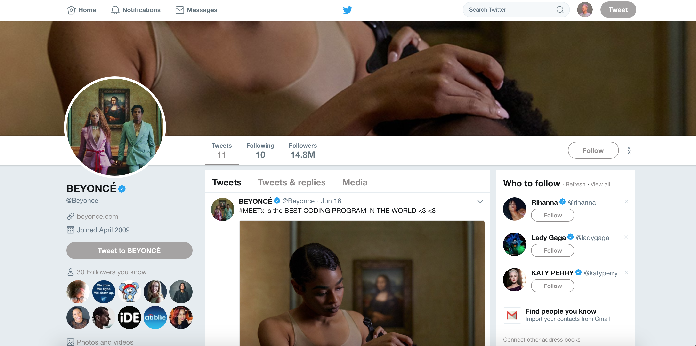
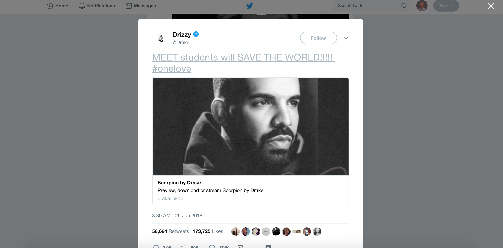

# Meeting 1: HTML 

### Day Before Checklist
- create Y1 Yearlong Course repo
- collect all github user names from students and make them collaborators on the course repo
- upload relevant materials
- text students
- review student code challenge submissions
- review deck and lecutre notes, including feedback from previous session
- pre set-up breakout rooms

### Day of Checklist
- set up your Zoom/BBB meeting 
- paste meeting link in Y1 Classroom Home
- upload the day's deck to 'presentation' in Y1 Classroom home
- Link to the github repo for the days lesson in 'Y1 Classroom' home


## Schedule
4:00 - 4:10 Do Now </br>
4:10 - 4:45 Lecture </br>
4:45 - 5:30 Lab </br>
5:30 - 5:50 Lab Review </br>
5:50 - 6:00 Wrap up + Feedback </br>

## Objective
***Students will learn the basics of HTML and be able to create their own HTML page from scratch***

## SWBATs
+ Structure an HTML page using doctype, html, head, title, and body tags
+ Add an image, link, paragraph text, and header text to a page
+ Create an ordered and unordered list using the ol, ul, li tags
+ Organize sections of HTML with div tags

## Deck

https://docs.google.com/presentation/d/1dryxDAI3OMBFa3Zr6uXlfa3QNgh2K5WCDxADPLWFg9U/edit#slide=id.g3ec78746d0_0_18

## To Do
WikiMapGame(Grapefruit, Astronaut)
Python Review

## Motivation / Why Should You Care?

+ **A Personal Website lab exists in the `CSS` section on Learn.co. Feel free to use this as your basis for having students learn HTML - they write the HTML for their personal sites, and then style it with CSS**

+ Start with an altered Tweet from a celebrity, which you've changed using Chrome's Developer Tools. For example, you can have Justin Bieber tweet: "I love MEETx and coding SO SO much!", or President Obama, "I am Barack Obama and I approve the MEETx." Tell students they'll know how to do that by the end of the lesson.


+ So far we've learned only about backend languages, Ruby in particular. How do we control what we see, though? That's where front-end programming comes in!
+ *Ask* students for their favorite websites and bring it up on the screen and click `view source`.
  + *THINK-PAIR-SHARE: Students break off into private video pairs for 3 MINUTES. Students go to a website of their choice on their own computers and right click and see the source code.  Ask them for 1 cool thing that they've learned.
+ Web pages are made up of two things: HTML and CSS. Every single web page on the internet contains HTML and CSS.
+ HTML stands for Hypertext Markup Language, and **every single website** on the internet is written in HTML. Every. Single. Page.
+ HTML provides the skeleton for websites and organizes the different elements on a page into categories like image, paragraph, and title. 
+ HTML doesn't have anything to do with the layout of text on a page or how the page looks. All it does is tell the browser what different types of content is on the page.
+ We use HTML to mark a navigation bar, tell the browser that this piece of content is an article, this is a caption related to this image, this is a menu with items on it, etc.
+ *Ask* the students why is this important.
  + I can simply look at a page to determine what type of content everything is.
  + Computers are stupid and can't infer knowledge the way we can. Semantic tags let computers know exactly what's what. Web crawlers like Google's use HTML to actual determine what text on a page is content, which helps Google put the appropriate content in the search results you see. Services like Pocket and Embedly use tags to pull certain parts of an article to save to your reading list, without pulling the entire site.


## Lesson Plan
+ Model how to create an html file in JSFiddle:
+ With the class, start by building out a website. *Prompt* students for topic for the website.
+ Prompt students for suggestions of what to put on a page.
+ `<!doctype html>`
  * Just like there are different versions of iphone apps, there are different versions of programming languages. The very first thing we have to do is tell the browser what version of HTML we're using. This is the doctype for HTML5, the most recent version of HTML.
+ `<html> </html>`
  * The html tag goes directly under the doctype. We use this tag to mark all of our HTML code.
  * HTML is comprised of tags that surround content. The opening tag `<html>` and the closing tag `</html>`. The closing html tag is the last tag on our page, the rest of the code in our page goes between them.
+ The page gets divided into two portions, much like a human - with the head and the body `<head></head>`
  * The head tag contains all the information about a page - "meta data"
  * Nothing inside the head actually gets displayed in the body of a page. 
  * Information for Google search goes in here, as well as lanaguge of the page
+ There is one tag that does display text in the head - the title tag
```html
<head>
  <title> Abdullah's awesome site </title>
</head>
```
  * the title tag controls the text in the tab of the browser
  * The opening tag, content, and closing tag is called and HTML element
+ All of the content that gets displayed in the browser had to be wrapped in a body tag
```html
<head>
  <title> My awesome site </title>
</head>
<body>
</body>
```
+ What's the very first thing you see on a website? It's title. We use the h1 tag to mark the title. You only use one h1 tag on a site.
```html
  <body>
    <h1> My title</h1>
  </body>
```
  * There are also h2, h3, h4, h5, h6 tags for various sized headers. h2 is usually a subheader, h3 for article credits.
+ For paragraphs, we use the p tag: `<p> my paragraph goes here</p>`
+ For images, we use the img tag. This tag is an exception to the rule - there is no closing tag: `
  * The `src` attribute is the source of the image. After the equals sign, in quotation marks, you put the image you want to display
  * you can enter a path to an image saved in your project directory, or an image url.

+ Ever ended up looking at a really random site online that was no where near what you started looking at? How did you end up there? LINKS! 
```html
<a href="https://www.google.com/search?q=puppies&espv=2&biw=1440&bih=726&source=lnms&tbm=isch&sa=X&ei=jp1kVaX5LuSCsQTI54DADg&ved=0CAYQ_AUoAQ"> CLICK HERE TO LOOK AT PUPPIES</a>
```
  * We use the `a` tag to mark a link
  * The `href` attribute of this tag is the hyper-reference to the link. IE- what page are you linking to
  * The text between the opening tag and closing tag is the text you click on the page to go to the link
+ Ordered List:
```html
  <ol>Food I Love (in preferential order)
    <li> Falafel </li>
    <li> Burritos</li>
    <li> Schwarma </li>
    <li> Zucchini </li>
  </ol>
```
  * To make an ordered list, we use the `ol` tag. The contents of the list are surrounded in opening and closing tags
  * All the list items are surrounded in the `li` tag.
+ Unorderd List:
```html
  <ul> Reasons MEET is awesome
    <li> Ted</li>
    <li> I get to hang with my friends </li>
    <li> Ted</li>
    <li> NOT the cafeteria food/li>
  </ul>
```
  * To create an unordered list, we use the `ul` tag.
+ In order to group specific HTML elements together, we use the div tag
```html
  <div>
    <p> I love all the food. Food is my favorite thing.</p>
    <ol>Food I Love (in preferential order)
      <li> Falafelt </li>
      <li> Burritos</li>
      <li> Schwarma </li>
      <li> Zucchini </li>
    </ol>
  </div>
```
 ### Interactive practice | Mini Challenge:
  
The point of this lab is to be exactly what it's called: A playground! What that means is that this is a place for you to experiment with HTML. Don't worry about making mistakes. We want you to get comfortable making mistakes, being okay making mistakes, and then learning from them.

Take a look at the Mozilla Developer Network HTML tag documentation for suggestions of tags to play with. Have fun making this site yours, and mess around with different HTML tags.

If you need some guidance getting started...

1. Use the title tag to give your page a title in the browser tab

2. Use an h1 tag to make the title of your page

3. Find a funny gif online and use the img tag to make it appear on your site

4. Use an <a> tag to put the location of the gif

Bonus Familiar with HTML and CSS? See if you can change the background color, font style, and font-color. This is going to be tricky but we're using Bootstrap, an external stylesheet, so you won't see all the CSS for the page in this directory. There is a way to do it though, so good luck!


* Now we've grouped together all the elements about food. 
  * Indentation is incredibly important in writing HTML, not for the computer but for human readability. MAKE SURE YOU INDENT!
+ Show HTML5 documentation and all the other tag possibilities there are.
  * [Mozilla Developer Network](https://developer.mozilla.org/en-US/docs/Web/HTML/Element) are great resources (companies don't like it when developers use W3C Schools site)

### Conclusion / So What?
+ The way a website looks is vital to the user having a good experience of it. If you navigate to a website that looks like it was built in 1992, you're much less likely to take it seriously. The first step in making sure your website will look good is making sure the content is appropriately structured with the proper HTML tags. The next step is giving it visual flair and style using CSS.

### Hints and Hurdles
+ Emphasize styling and indentation best practices with HTML
+ Set the expectation that HTML/CSS is a lot of playing and messing around and figuring things out by trial and error.
